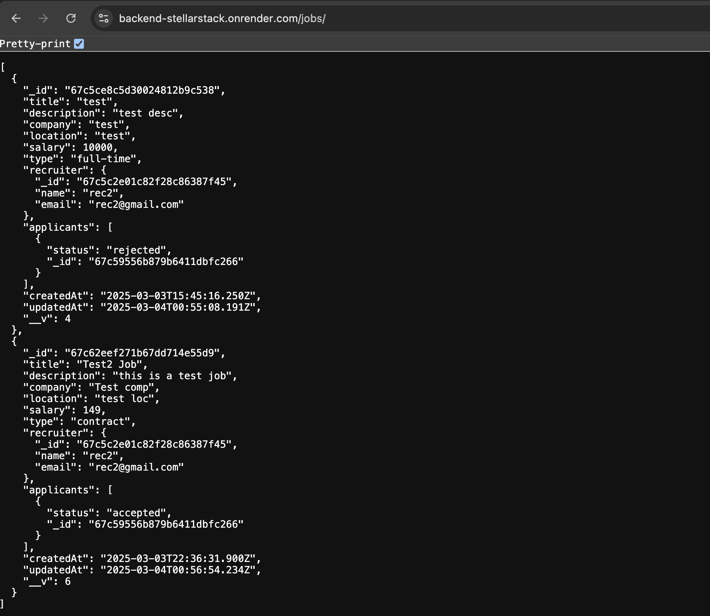
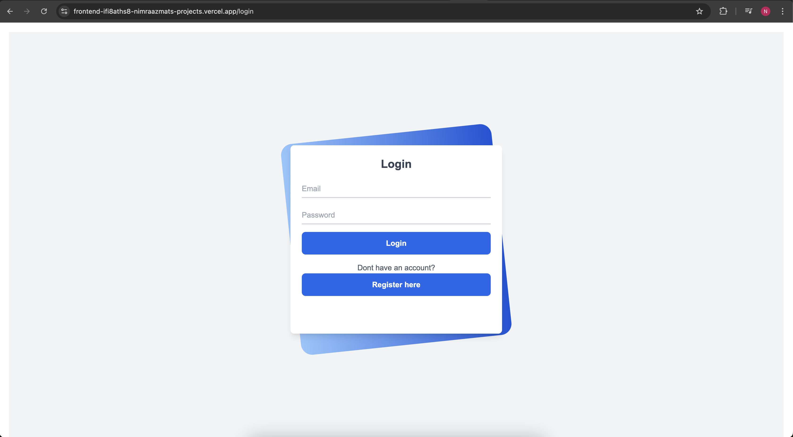

This is a [Next.js](https://nextjs.org) project bootstrapped with [`create-next-app`](https://nextjs.org/docs/app/api-reference/cli/create-next-app).

## Getting Started

First, run the development server:

```bash
npm run dev
# or
yarn dev
# or
pnpm dev
# or
bun dev
```

Open [http://localhost:3000](http://localhost:3000) with your browser to see the result.

## Overview
The frontend is built using Next.js, a popular React-based framework for building server-rendered and statically generated websites and applications. The frontend is designed to interact with a backend API to fetch and display data.

## Deployment
The frontend is deployed to **Vercel** and the backend is deployed using **Render**.
* Frontend Link: https://frontend-ifi8aths8-nimraazmats-projects.vercel.app/login
* Backend Link: https://backend-stellarstack.onrender.com/

## Testing
**Hosted API:**
`https://backend-stellarstack.onrender.com/jobs/`



**Frontend:**
`https://frontend-ifi8aths8-nimraazmats-projects.vercel.app/login`



## Pages
1. **Login Page**

The login page is responsible for handling user authentication.

    * Route: /login
    * Description: The login page is responsible for handling user authentication.

2. **Register Page**

The register page is responsible for handling user registration.

    * Route: /register
    * Description: The register page is responsible for handling user registration.

3. **Dashboard Page**

The dashboard page is the main page of the application.

    * Route: /dashboard
    * Description: The dashboard page is the main page of the application.

4. **Job Details Page**

The job details page is responsible for displaying job details.

    * Route: /job/:id
    * Description: The job details page is responsible for displaying job details.

5. **Job Applicants Page**

The job applicants page is responsible for displaying job applicants.

    * Route: /job-applicants/:id
    * Description: The job applicants page is responsible for displaying job applicants.

6. **Manage Applications Page**

The manage applications page is responsible for managing job applications.

    * Route: /dashboard/jobs/:id/applications
    * Description: The manage applications page is responsible for managing job applications.

7. **Manage Users Page**

The manage users page is responsible for managing users.

    * Route: /dashboard/admin/users
    * Description: The manage users page is responsible for managing users.

8. **Manage Jobs Page**

The manage jobs page is responsible for managing jobs.

    * Route: /dashboard/admin/jobs
    * Description: The manage jobs page is responsible for managing jobs.

9. **Edit Job Page**

The edit job page is responsible for editing job details.

    * Route: /dashboard/edit-job/:id
    * Description: The edit job page is responsible for editing job details.

10. **Create Job Page**

The create job page is responsible for creating new jobs.

    * Route: /dashboard/create-job
    * Description: The create job page is responsible for creating new jobs.

11. **Settings Page**

The settings page is responsible for managing user settings.

    * Route: /dashboard/settings
    * Description: The settings page is responsible for managing user settings.

## Styles
The frontend uses Tailwind CSS for styling.

* Config File: **tailwind.config.js**
* Description: The **tailwind.config.js** file is used to configure Tailwind CSS.
API

The frontend interacts with a backend API to fetch and display data.

**API Endpoint** : `https://backend-stellarstack.onrender.com/` 

**Description:**
The API endpoint is used to interact with the backend API.


## Components
Used Custom components using tailwind Css.


